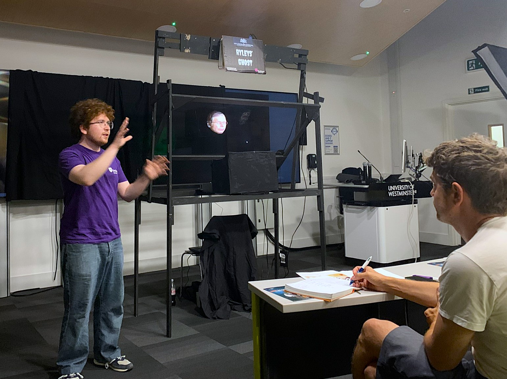

# NAHEMI AI Tutor: "Bringing the Elephant into the Room"


Python source code for (the AI component of) the AI Tutor demonstrated alongside a full Pepper's Ghost hologram of a talking head, at the **National Association for Higher Education in the Moving Image (NAHEMI)** annual conference, *Talking Shop 2026*. 

The project was created as a live demonstration for the talk **"Bringing the Elephant into the Room"** by [Stephen Ryley](https://www.westminster.ac.uk/about-us/our-people/directory/ryley-stephen-0) and [Oscar Ryley](https://oryley.com), presented on Thursday, June 25th, 2026.

## Demonstration

*(Video of the live conference demonstration will be hosted on NAHEMI's site soon and linked here)*


*Oscar and the Pepper's Ghost Illusion, dubbed "Ryleys' Ghost" - 25/06/2026*


## Setup

```bash
git clone https://github.com/Oscar-Ryley/NAHEMI-AI-Tutor.git
cd NAHEMI-AI-Tutor
pip install -r requirements.txt
```
> Ensure `ffmpeg` is installed and added to your system's PATH.


Get a [Google Gemini API Key](https://aistudio.google.com/) and an [ElevenLabs API Key](https://elevenlabs.io/), and change the `.env` file:
```env
GEMINI_API_KEY="{Key}"  
ELEVENLABS_API_KEY="{Key}"  
ELEVENLABS_VOICE_ID="{Voice_ID}"  
ELEVENLABS_MODEL_ID="{Model_ID ie. eleven_turbo_v2_5}"
```


## Citation

**BibTeX:**

```bibtex
@inproceedings{ryley_ai_2026,
  author       = {Ryley, Stephen and Ryley, Oscar},
  title        = {Bringing the Elephant into the Room},
  booktitle    = {Talking Shop 2026},
  year         = {2026},
  month        = {June},
  organization = {National Association for Higher Education in the Moving Image (NAHEMI)},
  note         = {Conference Talk. Demonstrated alongside a Pepper's Ghost hologram illusion.}
}
```

<p align="center">

&nbsp;&nbsp;&nbsp;&nbsp;&nbsp;&nbsp;

&nbsp;&nbsp;&nbsp;&nbsp;&nbsp;&nbsp;

</p>
